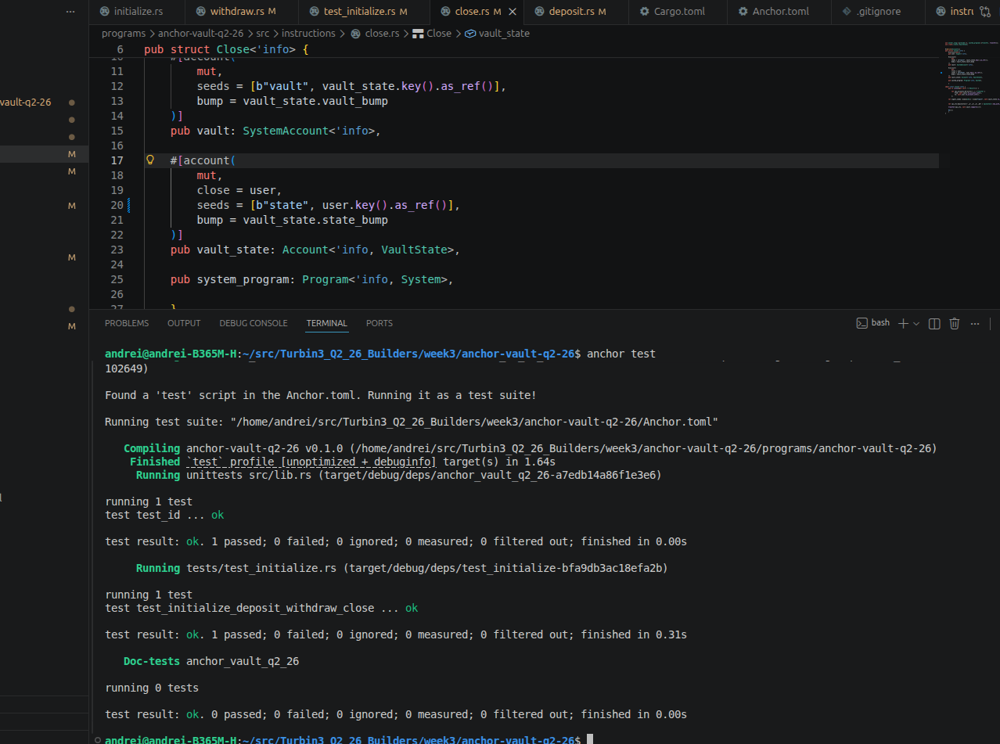

This project is a simple Solana vault program built with Anchor.

The vault supports four main instructions:

- `initialize`
- `deposit`
- `withdraw`
- `close`

## Tech Stack

- Rust
- Solana
- Anchor `1.0.2`
- LiteSVM for testing

## Program Flow

1. `initialize` creates the vault state and vault PDA.
2. `deposit` transfers SOL from the user to the vault.
3. `withdraw` transfers SOL from the vault back to the user.
4. `close` closes the vault and returns remaining lamports.

## Notes

This project uses Anchor `1.0.2`.

The CPI interface is different from older Anchor versions.  
In this version, `CpiContext` uses `System::id()` instead of `cpi_program = self.system_program.to_account_info()`

## Testing

LiteSVM is used for testing the program locally.

The test covers the positive flow:

initialize → deposit → withdraw → close

Test Result

Test result screenshot:

Run Tests

cd anchor-vault-q2-26
cargo test
